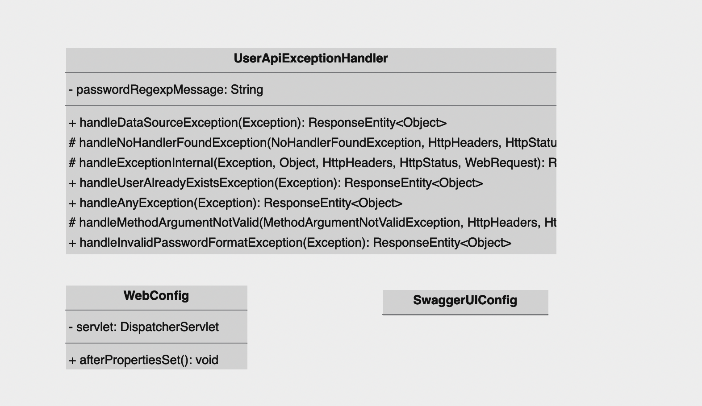

# springboot-jwt-openapi
Muestra de un simple picoservicio para la API REST de creacion de usuarios.

## Creacion del contrato del API
Antes de empezar a codear lo recomendable es, reunir las personas involucradas en el desarrollo, tanto del frontend
como backend y en tarea conjunta elaborar el contrato de comportamiento del API, luego cada parte puede empezar a
trabajar por su lado, confiando en el mismo, culaquier modificacion debe ser comunicada, asi se logra una separación 
de intereses lo que permite trabajar de forma paralela y dividida.

``` yaml
openapi: 3.0.0
info:
  title: OpenAPI document for Simple User Registry Microservice.
  description: REST API for managing web users, authorization and authentication using JWT.
  contact:
    name: API Support
    url: https://marcomarco.blog
    email: marcomarco@marcomarco.blog
  version: 0.0.1
servers:
  - url: http://127.0.0.1
    description: The development API server
    variables:
      port:
        enum:
          - '8092'
        default: '8092'
      basePath:
        default: /api/v1
paths:
  /api/v1/users:
    post:
      operationId: createUser
      summary: Create a User
      description: Lets create an userVo post a entry in users registry
      requestBody:
        required: true
        content:
          application/json:
            schema:
              $ref: "#/components/schemas/UserIn"

      responses:
        '201':
          description: OK userVo created
          content:
            application/json:
              schema:
                $ref: "#/components/schemas/UserOut"

        '400':
          description: Invalid query Params
          content:
            application/json:
              schema:
                $ref: "#/components/schemas/Error"
        '404':
          description: Service Not found
          content:
            application/json:
              schema:
                $ref: "#/components/schemas/Error"
        '409':
          description: User Already Exists
          content:
            application/json:
              schema:
                $ref: "#/components/schemas/Error"
        '500':
          description: Exception Error
          content:
            application/json:
              schema:
                $ref: "#/components/schemas/Error"

components:
  schemas:
    UserIn:
      type: object
      required:
        - email
        - password
        - phones
      properties:
        name:
          type: string
          minLength: 36
          maxLength: 200
        email:
          type: string
          format:
            email
          pattern: '^[\w-\.]+@([\w-]+\.)+[\w-]{2,4}$'
        password:
          type: string
          format:
            password

        phones:
          type: array
          items:
            type: object
            properties:
              number:
                type: integer
                minimum: 6
                maximum: 9
              citycode:
                type: integer
                minimum: 1
                maximum: 3
              contrycode:
                type: integer
                minimum: 1
                maximum: 3
    UserOut:
      type: object
      properties:
        id:
          type: string
          minLength: 36
          maxLength: 36
          format:
            uuid
        created:
          type: string
          format:
            date-time
        modified:
          type: string
          format:
            date-time
        last_login:
          type: string
          format:
            date-time
        token:
          type: string
        isactive:
          type: boolean

      allOf:     # Combines the User and the output model
        - $ref: '#/components/schemas/UserIn'

    Error:
      type: object
      required:
        - message
      properties:
        message:
          type: string

```
Haga copiar y pegar el contrato en la siguiente direccion: https://editor-next.swagger.io/

## Diagrama de Clases
Se agruparon dichos diagramas en cuatro, segun su rol en la aplaicacion:
- Elementos Globales de la aplicacion
* Presentacion
+ Dominio
* Datos

La division en esos grupos permite desacoplar en dominios y funciones para lograr
una independencia entre cada uno de ello, logrado que la capa logica de negocios (Domain)
sea independiente de la presentacion y el origen de datos.

### Elementos Globales
Corresponde a aquellos elementos que aplican a toda la aplicacion.



### Elementos de Presentacion
En este caso dichos componentes permiten la exposicion de los serrvicios ofrecidos desde la API, hacia 
sus posibles consumidores via HTTP.


capas:
* Presentacion -> Encargada de manejar HTTP
* Servicio -> Delgada capa para encargarse de preparar los DTO para pasarlos al Port
* Port -> Punto de union con el Adapter de la capa de negocio. (Dependency Inversion)

### Elementos de Dominio
Aqui reposa la logica de negocios de forma independiente, ya que al aplicar el principio de inversion de 
dependencia, logramos desacoplar dicha capa de la presentacion y de los datos.


capas:
* domain -> Encargada de la logica de negocios y subdividida en:
 * Adapter -> Delgada capa para unir con el Port de presentacion
 * Port -> Punto de union con el Port de la capa de datos.

### Elementos de Persistencia
Se encarga de agrupar todos los posibles origenes y destino de datos que alimentan
o persiten de alguna forma la informacion a ser enviada de vuelta.


capas:
* repository -> Encargada de la logica de negocios y subdividida en:
* Adapter -> Implementacion del Adapter de la capa de negocios
* datasource -> encargada de agrupar las fuentes de datos.

Asi concluye mi entendimiento de una sencilla arquitectura hexagonal.

## Instrucciones para ejecucion

### Requerimientos minimos
.- Java 8
### Forma Basica
```
./gradlew bootRun
```
#### Llamar al API

### Postman
```
curl --location 'http://localhost:8092/api/v1/users' \
--header 'Content-Type: application/json' \
--data-raw '{
    "name": "Juan Rodriguez",
    "email": "juan@rodriguez.org",
    "password": "hunter2",
    "phones": [
        {
        "number": "1234567",
        "citycode": "1",
        "contrycode": "57"
        }
    ]
}'
```

## Usando Docker

### Requerimientos
.- Docker

## Contruyendo y ejecutando la imagen

```
./gradlew build
chmod +rwx build-run-app 
./build-run-app
```

## Liberando recursos

```
docker rm $(docker stop $(docker ps -a -q --filter ancestor=mmontilla/user-registry:0.0.1 --format="{{.ID}}"))
docker rmi mmontilla/user-registry:0.0.1
```


### Reference Documentation
For further reference, please consider the following sections:

* [Official Gradle documentation](https://docs.gradle.org)
* [Spring Boot Gradle Plugin Reference Guide](https://docs.spring.io/spring-boot/docs/3.2.0/gradle-plugin/reference/html/)
* [Create an OCI image](https://docs.spring.io/spring-boot/docs/3.2.0/gradle-plugin/reference/html/#build-image)
* [Spring Web](https://docs.spring.io/spring-boot/docs/3.2.0/reference/htmlsingle/index.html#web)
* [Spring Security](https://docs.spring.io/spring-boot/docs/3.2.0/reference/htmlsingle/index.html#web.security)
* [Spring Data JPA](https://docs.spring.io/spring-boot/docs/3.2.0/reference/htmlsingle/index.html#data.sql.jpa-and-spring-data)
* [Spring Boot DevTools](https://docs.spring.io/spring-boot/docs/3.2.0/reference/htmlsingle/index.html#using.devtools)

### Guides
The following guides illustrate how to use some features concretely:

* [Building a RESTful Web Service](https://spring.io/guides/gs/rest-service/)
* [Serving Web Content with Spring MVC](https://spring.io/guides/gs/serving-web-content/)
* [Building REST services with Spring](https://spring.io/guides/tutorials/rest/)
* [Securing a Web Application](https://spring.io/guides/gs/securing-web/)
* [Spring Boot and OAuth2](https://spring.io/guides/tutorials/spring-boot-oauth2/)
* [Authenticating a User with LDAP](https://spring.io/guides/gs/authenticating-ldap/)
* [Accessing Data with JPA](https://spring.io/guides/gs/accessing-data-jpa/)

### Additional Links
These additional references should also help you:

* [Gradle Build Scans – insights for your project's build](https://scans.gradle.com#gradle)
* [OpenAPI Specification formerly Swagger Specification](https://swagger.io/docs/specification/about/)